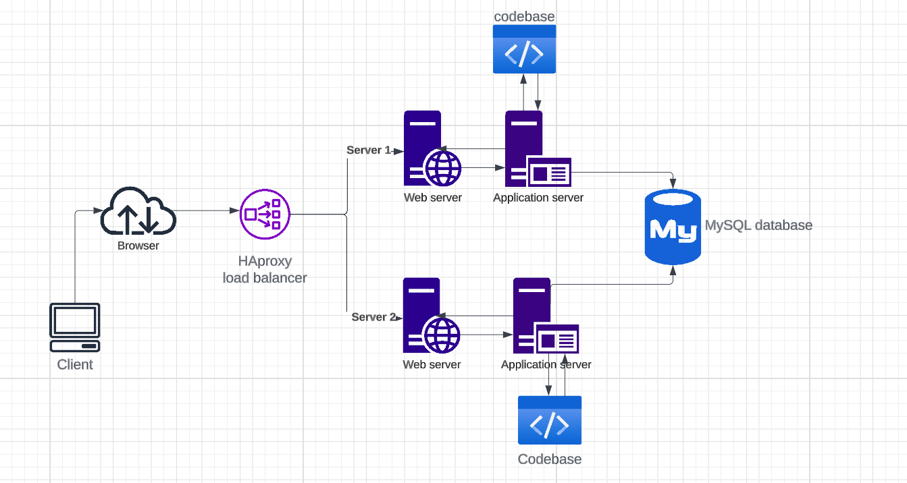

## Distributed web infrastructure

## Description
 This is a simple web infrastructure that hosts a website that is reachable v    ia `www.foobar.com`. There are no firewalls or SSL certificates for protecti    ng the server's network. Each component (database, application server) has t    o share the resources (CPU, RAM, and SSD) provided by the server.

## Specifics
 - **Load Balancer** - It distributes incoming traffic between server 1 and server 2, improving scalability and availability

 - **Web server (Nginx)** - it serves static files and handles client requests by forwarding requests to the application server for processing

 - **Database** - It stores and manages the website data. It is used by the application servers in processing dynamic data

- **Codebase** - this consists of the code used by the application servers to process dynamic requests

## Load balancer distribution
- The load balancer is configured with a round-robin distribution algorithm which ensures incoming requests are evenely distributed between server1 and server 2 sequentially. The load balancer loops through the server addresses in the server pool and assigns a different address in the pool each time a request is made.

## Active-active vs Active-passive setup
- The load balancer is using an Active-active setup, this means all the load balancers (in this case one) are all forwarding network traffic silmutaneously with no load balancers on stand by. This maximizes on usage of resources and provides better perfomance

## Database Primary-Reploca Cluster (Master slave)
- The MySQL database is configured as a primary-replica cluster. The primary node acts as the authority source, handling the read and write operations while the replica nodes replicate data from the primary node

## Primary Node vs Replica Node
- The Primary node in the database cluster is responsible majorly for handling write operations. It performs updates to the database on request
- The Replica node copies data from the primary node and serves the functiion of performing read operations.

## ISSUES
- **SPOF (Single point of failure)** - The load balancer is a SPOF since it is the only load balancer and if it fails, traffic is not forwaded to the servers
- **Security issues** - The infrastructure lacks security measures such as a firewall or HTTPS encryption, this exposes sensitive data.
- **Lack of Monitoring** - The infrastructure lacks monitoring tools to monitor perfomance and identification of anomalies.
