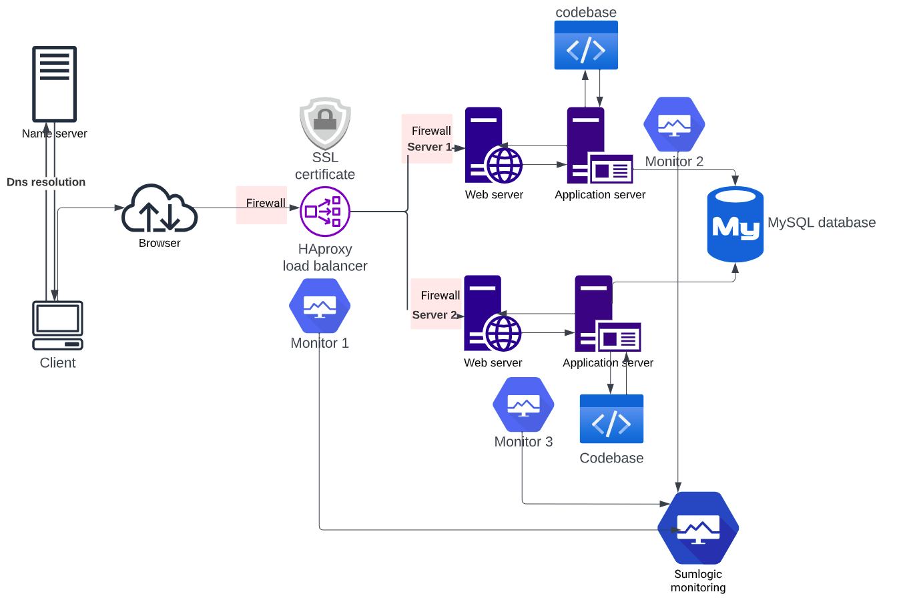

## Secured and monitored infrastructure

## Description
 This is a simple web infrastructure that hosts a website that is reachable via `www.foobar.com`. There are three firewalls and one SSL certificate for securing the server's network, One load balancer , two servers and three monitoring clients for Sumlogic.

## Specifics
 - **Load Balancer** - It distributes incoming traffic between server 1 and server 2, improving scalability and availability.
                     - It terminates SSL/TLS connections and decrypts the traffic before forwading it to the backend servers

 - **Web server (Nginx)** - it serves static files and handles client requests by forwarding requests to the application server for processing

 - **Application servers** - Responsible for serving the website's applicatiion logic
                           - They handle dynamic content generation and processing user requests forwaded by the web server.
 - **Database** - It stores and manages the website data. It is used by the application servers in processing dynamic data. One server is designated as the primary server to handle write requests.

- **Firewalls** - enforces access control and provide network security, protecting against unaothorized access to the servers.

- **SSL certificate** - enables secure connection over HTTPS between the clients and the web servers. HTTPS encrypts data transmitted between the client and the server ensuring confidentiality.

- **Monitoring clients (data collectors)** - Deployed to gather perfomance metrics and other relevant data for monitoring and troubleshooting purposes

## How monitoring collects data
 - Monitoring clients in each server collect data from various sources including server logs , perfomance counters, network traffic etc.
 - The collected data is aggregated and sent to the centralized monitoring service for analysis and visualization

## How to monitor server QPS (Queries Per Second)
 - To monitor QPS you can use a combination of server logs and perfomance metrics
 - Relevant information such as number of requests served within a specific time frame and the amount of time can be used to calculate the queries per second
 - Also, metrics such as CPU usage, memory utilization and network throughput can provide insights into the server's capacity.

## ISSUES
- **Terminating SSL/TLS at the load balancer level** - Decrypting SSL/TLS traffic at the load balancer adds extra processing overhead which can impact the perfomance of the load balancer. This also makes the load balancer more vulnerable to attacks targeting the SSL/TSL terminating point.
- **Single MySQL server accepting writes** - Having a single MySQL server capable of accepting writes pauses a SPOF
- **Identical components on servers** - Having servers with the same components is problematic since when a critical component fails, it affects all the servers silmutaneously potentially causing system outage. Components should be distributed across servers to ensure fault tolerance and scalability.
